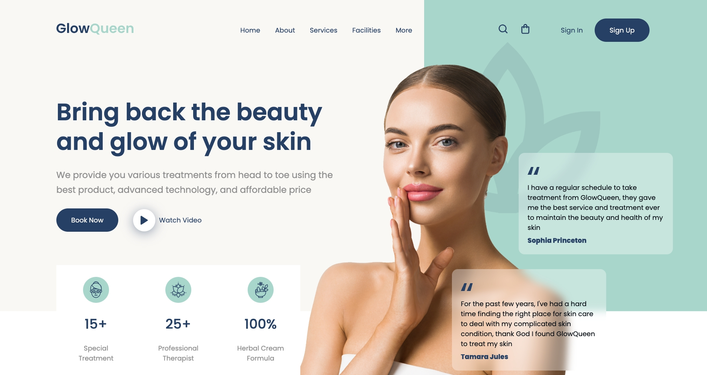

# Header Beauty Spa - CSS Final Project

## 📌 Descripción

Este es mi **proyecto final público de frontend web**, donde aplico lo aprendido en **HTML y CSS**. He utilizado tecnologías y herramientas clave como:

- **Sass**: Uso de variables, anidación y organización de estilos.
- **Vite**: Para gestionar el entorno de desarrollo y mejorar la velocidad de compilación.
- **Git**: Control de versiones para gestionar cambios de manera eficiente.
- **Tipografías personalizadas**: Implementación de fuentes específicas según el diseño.
- **Animaciones y efectos**: Uso de `:hover` y otros efectos para mejorar la experiencia visual.

Este proyecto forma parte de mi **máster en desarrollo Full Stack** en la escuela **Conquer Blocks**.

## 🎨 Proceso de Desarrollo

El diseño se basa en un archivo **Figma (.fig)** recibido, del cual desarrollé la página desde cero. El proceso incluyó:

1. Descarga de **assets** como iconos en formato SVG e imágenes.
2. Obtención de **tipografías y colores** según el diseño original.
3. Uso de **medidas y proporciones** fieles al archivo de Figma.
4. Aplicación de estilos avanzados con **Sass y variables CSS**.
5. Implementación de efectos visuales como `:hover` para mejorar la interacción.

## 🚀 Características

- **Landing page estática** con un diseño profesional.
- Implementación de **tipografía, animaciones y colores fieles** al diseño original.
- **Uso de Sass** para mantener una estructura de estilos organizada y modular.
- **Sin comportamiento responsive** en esta versión.

## 📂 Tecnologías Utilizadas

- HTML5
- CSS3
- Sass (SCSS)
- Flexbox
- Vite
- Git y GitHub

## 📌 Contacto

Si quieres conocer más sobre mi trabajo, puedes encontrarme en:

- **GitHub**: [@mario-sound](https://github.com/mario-sound)
- **LinkedIn**: [LinkedIn](https://www.linkedin.com/in/mariosanchezsonido/)

¡Gracias por visitar este proyecto! 🚀
